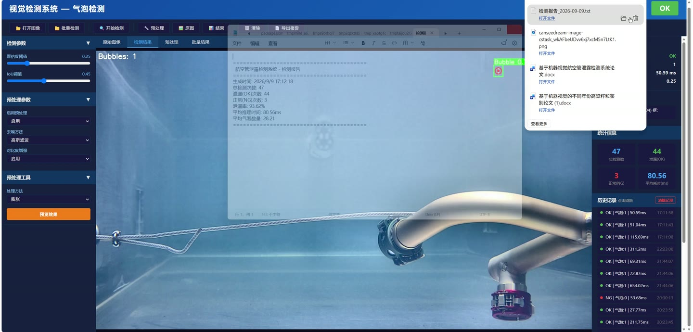
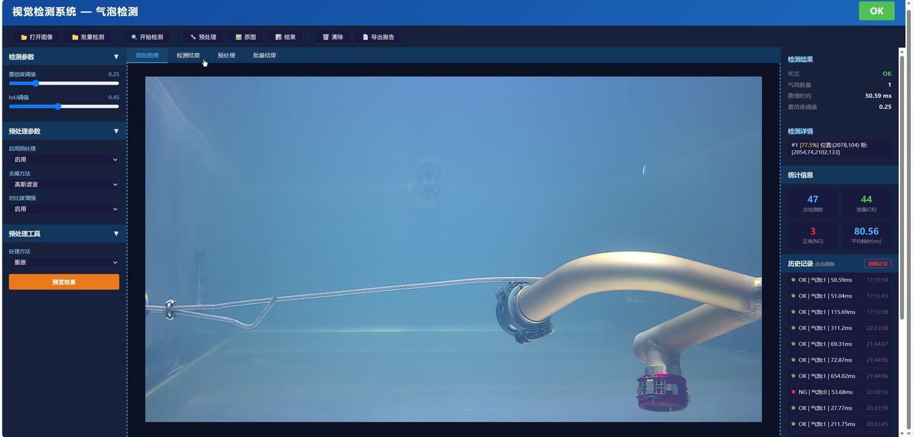
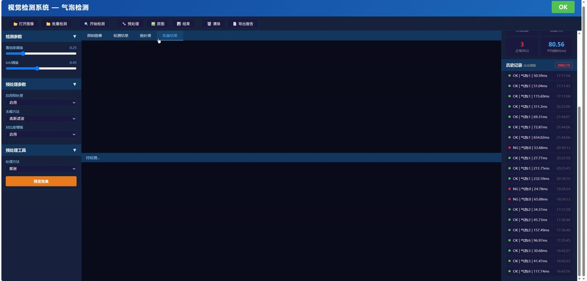
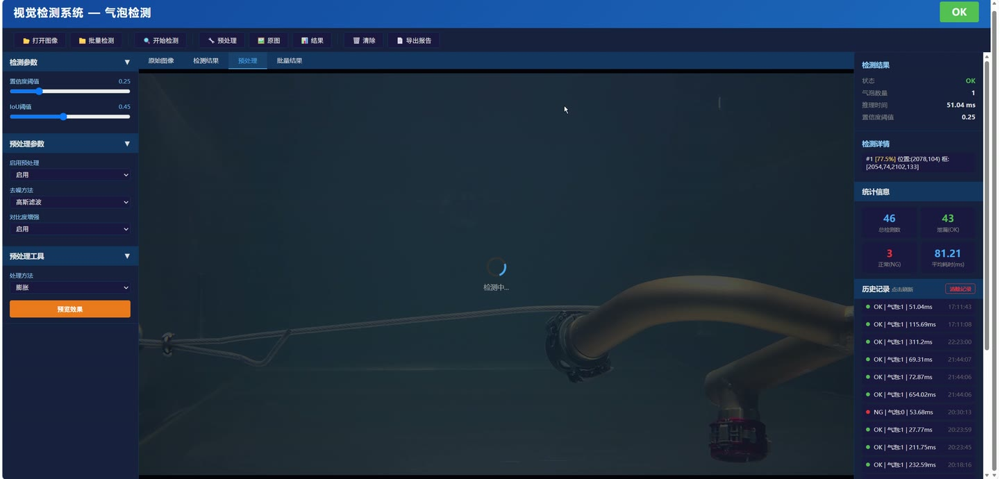
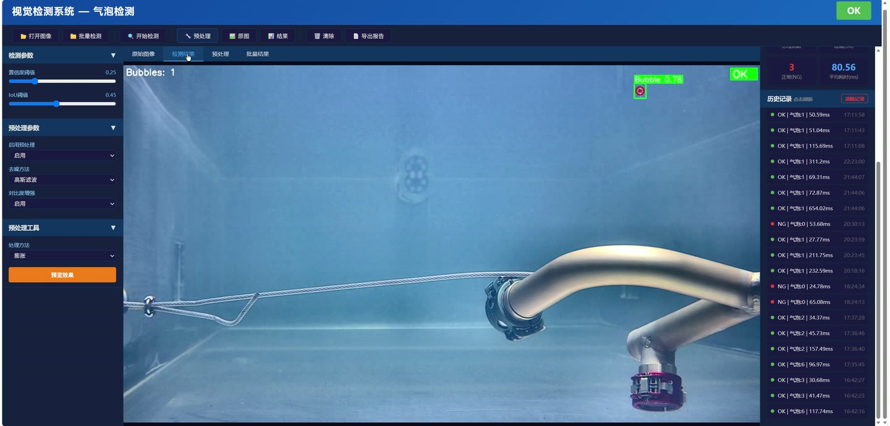

# (附文档)Python+YOLO+深度学习 基于机器视觉航空管泄露检测系统

**技术栈**：Python、Flask、PyTorch、TensorFlow、YOLO、深度学习

### 系统简介

本系统是基于 Python 与深度学习框架构建的航空管泄漏机器视觉检测平台，采用前后端分离架构，后端以 Flask 提供接口服务，集成 YOLO 目标检测与 TensorFlow/PyTorch 推理能力，对航空管路图像进行泄漏区域识别、定位与结果可视化。系统包含普通用户端与管理员端两类角色，覆盖图像上传检测、检测记录管理、模型配置与数据统计等业务环节。
 
### 核心功能
 
### 普通用户端

 
- 上传待检测图像：支持通过表单上传本地图片文件，后端以字节流方式读取并转为 PIL 图像对象。 
- 发起目标检测请求：向 /v1/object-detection/<model> 接口以 POST 方式提交图像，指定调用的模型名称。 
- 选择检测模型：可在请求中切换不同已加载的模型（如 yolov5s、yolov5n），服务端按模型名路由到对应权重。 
- 获取检测结果：接口以 JSON 记录形式返回检测框坐标、置信度与类别，便于前端渲染。 
- 查看检测可视化图：可获取带边界框标注的图像，标注含类别名与置信度百分比。 
- 调整检测置信度阈值：对低于阈值（默认 0.25）的检测框进行过滤展示。 
- 查看检测统计指标：可查看精确率、召回率、F1、mAP@0.5、mAP@0.5:0.95 等指标结果。 
- 查看训练与验证曲线：可查看损失曲线、PR 曲线、F1 曲线、混淆矩阵等图表。 
- 浏览检测批次样本：可查看训练批次与验证批次的图像样本及其标注框。
 
### 管理员端

 
- 加载与管理检测模型：通过命令行参数指定一个或多个模型（--model）在服务启动时加载。 
- 配置服务端口：通过 --port 参数设置 Flask 服务监听端口，默认 5000。 
- 管理数据集配置：支持从 ClearML 数据集读取 YAML 定义，解析 train、val、test、nc、names 字段。 
- 管理训练超参数：可配置学习率 lr0、lrf、momentum、weight_decay、warmup 系列参数。 
- 管理损失权重：可配置 box、cls、obj、cls_pw、obj_pw、fl_gamma 等损失相关权重。 
- 管理数据增强参数：可配置 hsv_h/s/v、degrees、translate、scale、shear、perspective、flipud、fliplr。 
- 管理混合增强策略：可配置 mosaic、mixup、copy_paste 等增强概率。 
- 配置锚框匹配阈值：可设置 anchor_t 与 iou_t 控制正样本匹配范围。 
- 查看训练日志与指标：支持 CSV、TensorBoard、WandB、ClearML、Comet 多种日志后端记录。 
- 模型保存与断点续训：按 save_period 周期保存权重，并支持从 last.pt 恢复中断的训练。 
- 执行超参数优化：基于 Optuna 对学习率、动量、损失权重等参数进行自动寻优。 
- 查看最优结果汇总：记录 best/epoch、best/precision、best/recall、best/mAP 等最优指标。
 
### 技术栈

 开发语言Python 后端框架Flask 深度学习框架PyTorch、TensorFlow 目标检测模型YOLO（YOLOv5 系列） 图像处理OpenCV、Pillow、NumPy 数据与可视化Matplotlib、Pandas 实验跟踪TensorBoard、Weights & Biases、ClearML、Comet 超参优化Optuna（ClearML HPO） 配置格式YAML 接口风格RESTful JSON API
 
### 交付内容

 
- 后端完整源码 
- 前端完整源码 
- 数据库初始化脚本 
- 万字文档

## 界面展示

---

## 获取完整源码 + 万字文档

本仓库为项目介绍页。**完整前后端源码、数据库初始化脚本、万字项目文档**，请加微信 `kangkangcode`，或访问 [codekk.top](http://codekk.top) 获取。

可作课程设计 / 毕业设计参考，支持远程部署调试。